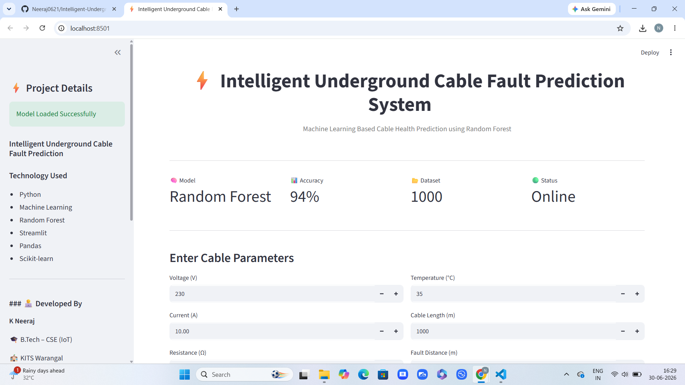
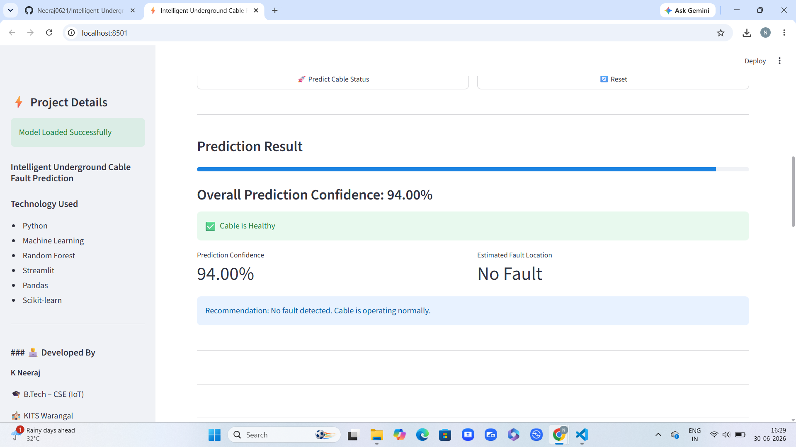
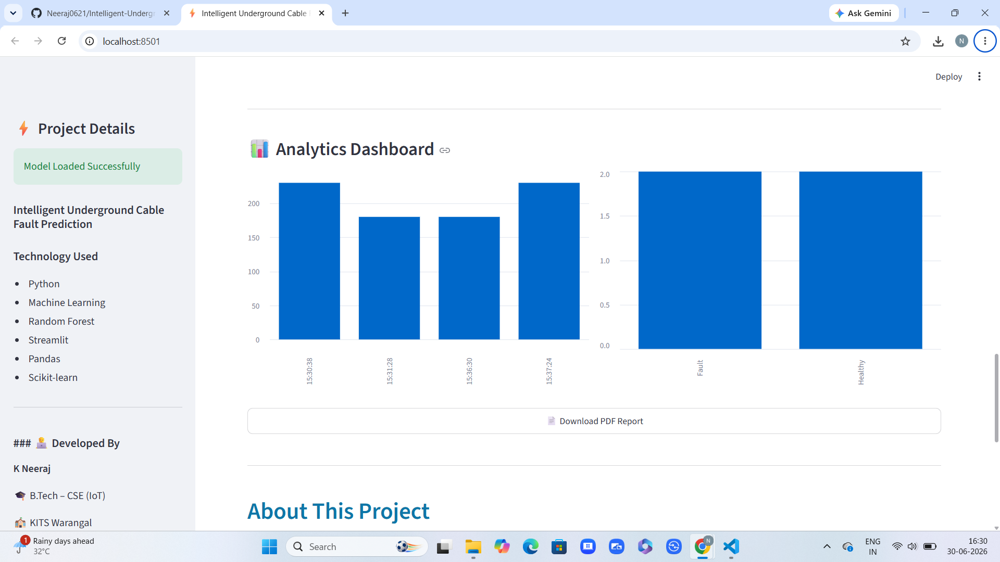

# Intelligent Underground Cable Fault Prediction System

## Overview

The Intelligent Underground Cable Fault Prediction System is a Machine Learning-based web application developed using Python and Streamlit. It predicts whether an underground cable is Healthy or Faulty using a trained Random Forest model based on electrical and environmental parameters.

---

## Features

- Real-time cable fault prediction
- Random Forest Machine Learning model
- Prediction confidence score
- Estimated fault location
- Live sensor readings dashboard
- Prediction history
- Project statistics
- Analytics dashboard
- Download prediction history as CSV
- Generate PDF report
- Responsive Streamlit interface

---
## Application Screenshots

### Home Page



### Prediction Result



### Analytics Dashboard


## Technologies Used

- Python
- Streamlit
- Pandas
- NumPy
- Scikit-learn
- Matplotlib
- ReportLab

---

## Machine Learning Model

- Algorithm: Random Forest Classifier
- Dataset Size: 1000 Records
- Accuracy: 94%

---

## Input Parameters

- Voltage
- Current
- Resistance
- Temperature
- Cable Length
- Fault Distance
- Fault Type

---

## Output

- Healthy / Fault Prediction
- Prediction Confidence
- Estimated Fault Location
- Recommendation

---

## Project Structure

```
Intelligent-Underground-Cable-Fault-Prediction-System
│
├── app.py
├── train_model.py
├── requirements.txt
├── README.md
├── dataset/
├── model/
├── diagrams/
├── documents/
└── screenshots/
```

---

## Developer

**K. Neeraj**

B.Tech – CSE (IoT)

Kakatiya Institute of Technology and Science (KITS), Warangal

---

## How to Run

Install the required libraries:

```bash
pip install -r requirements.txt
```

Run the application:

```bash
streamlit run app.py
```

---

## License

This project was developed for academic and educational purposes.